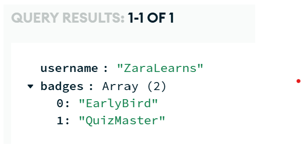
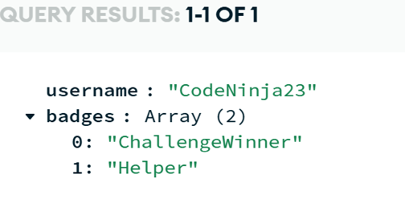

# Gamification-Leaderboard-System-
📄 Project Description 

A NoSQL-based leaderboard and gamification system built with MongoDB. This project simulates an educational platform where users earn badges and points through quizzes and challenges.
It includes multiple collections such as users, activities, badges, challenges, and leaderboards. I designed and implemented the data logic, wrote MongoDB queries, and created sample data to demonstrate functionality.

# Top 3 Users Aggregation Query

# User Badges Projection

# Activities by User Sorted by Date  

# Total Points Earned by a User  

## 📸 Screenshots

### Query: Top 3 Users Aggregation  
 

### Query: User Badges Projection  
 

### Query: Activities by User Sorted by Date  
 

### Query: Total Points Earned by a User  
 

